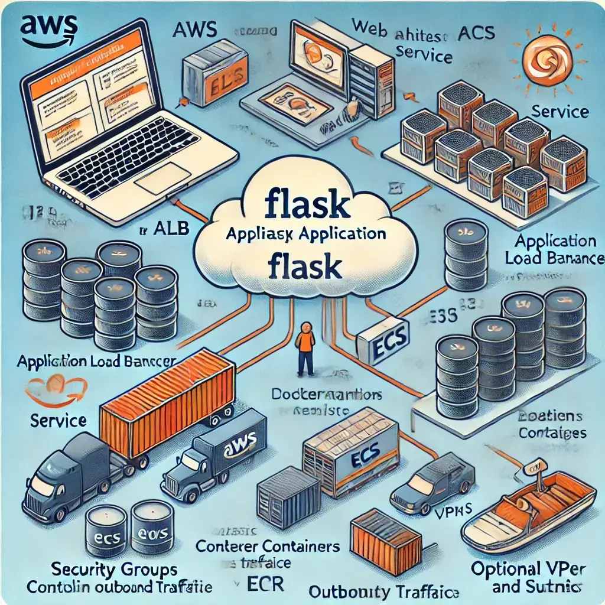

# AWS-Flask-App-Deployment-Architecture

<!--
⚡ Bolt Optimization:
- Explicit width/height (1024px): Prevents Cumulative Layout Shift (CLS) by reserving space in the layout before the image loads. Impact: Reduces CLS from ~1.0 (full image height shift) to 0.0.
- loading="eager": Signals that this is a critical hero element (LCP), ensuring the browser starts fetching it immediately.
- decoding="async": Offloads image decoding from the main thread, preventing it from blocking the rendering of the following text content.
-->

This diagram illustrates the architecture for deploying a Flask application on AWS. It showcases the flow from the user accessing the app through the Application Load Balancer (ALB), which routes traffic to an ECS service running Docker containers. These containers pull the Flask app image from Amazon ECR.
